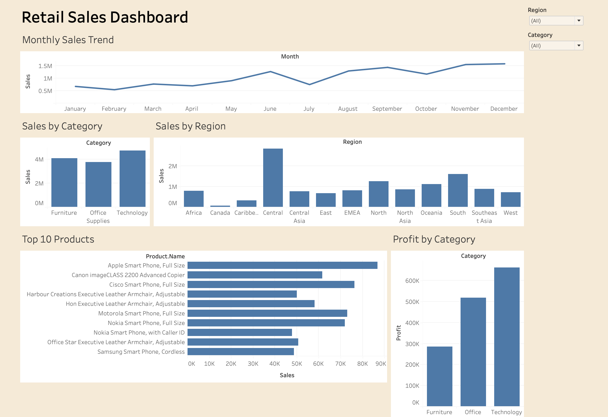

# 📊 Retail Sales Analytics Dashboard

## Project Overview

This project analyzes retail sales data using Python and Tableau.

The data was cleaned using Python (Pandas) and visualized in Tableau to create an interactive dashboard. The dashboard helps understand sales performance, product performance, regional sales, and profit.

---

## Dashboard Preview



---

## Tools Used

- Python
- Pandas
- Google Colab
- Tableau
- GitHub

---

## Dataset

**Dataset:** Global Superstore

The dataset includes:
- Orders
- Customers
- Products
- Categories
- Sales
- Profit
- Regions

---

## Dashboard Features

- Monthly Sales Trend
- Sales by Category
- Sales by Region
- Top 10 Products
- Profit by Category
- Interactive Filters

---

## Key Insights

- Technology has the highest sales.
- Technology also has the highest profit.
- Sales are different across regions.
- A few products generate most of the sales.
- Monthly sales change throughout the year.

---

## Project Files

```
Retail-Sales-Analytics-Dashboard
│
├── Retail_Sales_Analytics.ipynb
├── Retail_Sales_Cleaned.csv
├── Retail_Sales_Dashboard.twb
├── dashboard.png
├── README.md
└── LICENSE
```

---

## How to Use

1. Open the Python notebook.
2. Run all cells.
3. Open the Tableau dashboard.
4. Use the filters to explore the data.

---

## Author

**Parth Soni**

Aspiring Data Analyst
